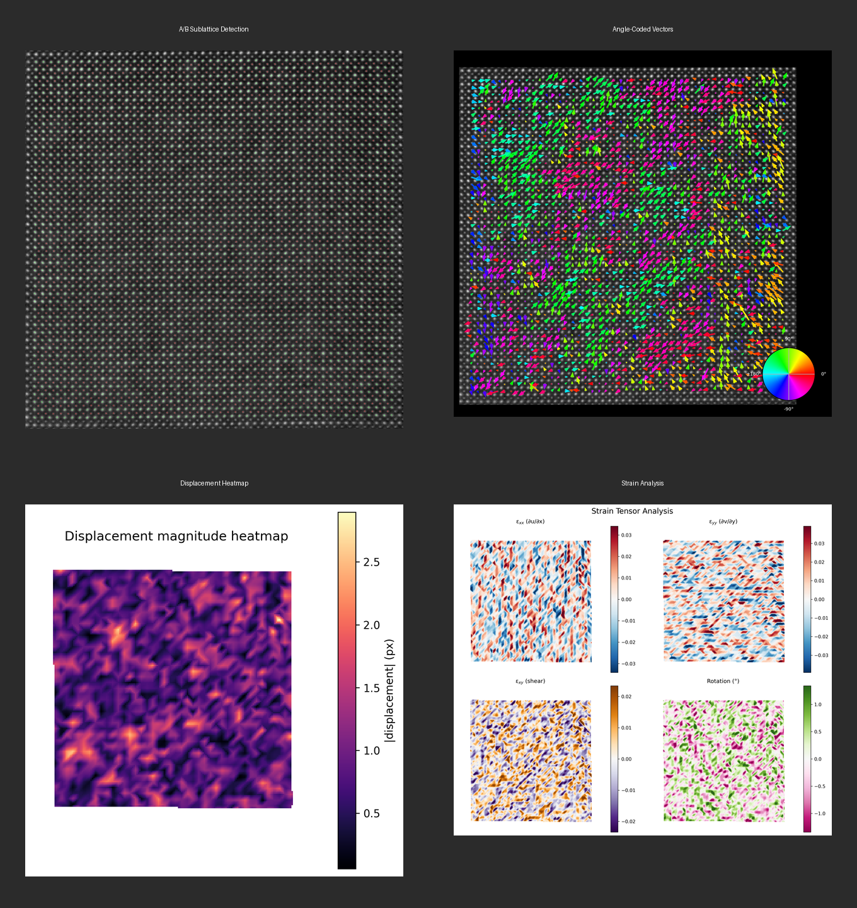

# STEM Atomap GUI

[](https://opensource.org/licenses/MIT)
[](https://www.python.org/downloads/)

**A powerful, user-friendly desktop application for Scanning Transmission Electron Microscopy (STEM) atomic position analysis.**
**一个功能强大且用户友好的桌面应用程序，用于 STEM 原子位置分析。**

Built on the robust [Atomap](https://atomap.org/) library and PySide6, this tool automates the quantification of lattice distortions, polarization, and strain fields, producing publication-quality visualizations.
基于 Atomap 库和 PySide6 构建，自动化量化晶格畸变、极化和应变场，生成出版级质量的可视化图表。



---

## 🚀 Key Features / 主要功能

* **Automated Lattice Analysis / 自动化晶格分析**
  * Detects A/B sublattices and computes atomic displacements.
  * 自动检测 A/B 子晶格并计算原子位移。

* **Rich Visualization / 丰富的可视化**
  * **Vector Maps**: Color-coded by angle (direction) or magnitude.
  * **Strain Maps**: Full tensor ($\varepsilon_{xx}, \varepsilon_{yy}, \varepsilon_{xy}$) and rotation analysis.
  * **Heatmaps**: Interpolated magnitude maps with smart edge masking.
  * **矢量图**：按角度或模长着色。
  * **应变图**：完整的应变张量及旋转分析。
  * **热图**：具有智能边缘遮罩的位移模长插值图。

* **Statistical Tools / 统计工具**
  * Histograms and polar plots for displacement statistics.
  * 位移模长直方图和角度极图。

* **Publication Ready / 出版级输出**
  * Automatic scale bars, physical units (nm/pm), and high-res outputs.
  * 自动比例尺、物理单位转换和高分辨率输出。

## 📚 Documentation / 文档

👉 **[Read the User Manual / 阅读用户手册](docs/USER_MANUAL.md)**
(Contains detailed usage, algorithm, and parameter guides / 包含详细用法、算法及参数说明)

## ⚡ Quick Start / 快速开始

1. **Run the GUI / 运行软件**:

    ```bash
    python main.py
    ```

2. **Analyze / 分析**:
    * Click **"Select Image"** to load a `.dm3` or `.tif` file. (点击 "Select Image" 加载图像)
    * (Optional) Adjust `Gaussian σ` or `Separation` in the sidebar. (可选：调整高斯平滑或晶格分离度参数)
    * Click **"Run"**. (点击 "Run" 运行)
    * Explore results in the tabs. (在标签页中查看结果)

## 🛠️ Installation / 安装

1. **Clone the repository**:

    ```bash
    git clone https://github.com/BMProjects/STEM_atomap_GUI.git
    cd STEM_atomap_GUI
    ```

2. **Install dependencies**:

    ```bash
    pip install -r requirements.txt
    ```

## 🏗️ Structure / 项目结构

* `main.py`: Entry point. (程序入口)
* `core/`: Algorithms (preprocessing, metrics, viz). (核心算法)
* `ui_qt/`: Interface code. (界面代码)
* `docs/`: Documentation. (文档)

## 🤝 Contributing

Contributions are welcome! Please verify changes with `python tests/test_pipeline.py`.

## 📄 License

This project is licensed under the MIT License.
